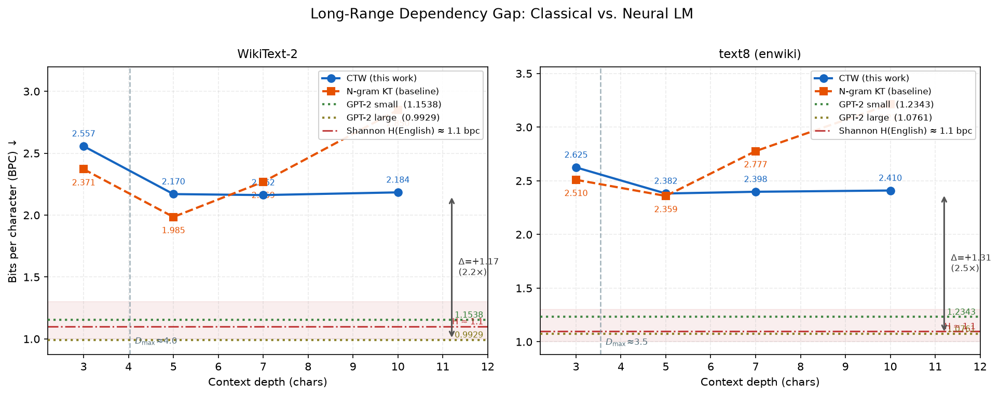

# Finite-Memory Language Modeling with Context Trees

Research code and experimental artifacts from the **CUHK-Shenzhen Elite
Undergraduate Summer Camp 2026**. The project studies how classical
finite-memory language models compare with neural language models, with a
focus on Context-Tree Weighting (CTW), data sparsity, and character-versus-word
granularity.

## Research questions

1. How large is the predictive gap between finite-memory models and GPT-2 on
   natural text?
2. Is that gap caused primarily by limited context length or by sparse context
   statistics?
3. When does word-level modeling improve on character-level modeling?

## Main findings

- The character context-tree model reaches **2.162 bits per character (BPC)**
  at depth 7 on WikiText-2, versus **1.154 BPC** for GPT-2 small.
- The empirical conditional-entropy estimate at depth 7 is **1.205 BPC**,
  suggesting that most of the observed gap is associated with sparse context
  estimates rather than context length alone.
- The largest excess loss occurs at word-initial characters, where long-range
  semantic context is most useful.
- Word-level depth 1 is consistently preferable to depth 2 at the available
  corpus size, matching the predicted context-sparsity limit.

See the [research report](report.pdf) for the full methodology, results, and
limitations, and the [slides](slides.pdf) for a shorter overview.



## Repository structure

```text
ctw/
  binary_ctw.py       Exact integer-arithmetic binary CTW implementation
  text_ctw.py         Practical interpolated context-tree model for text
  metrics.py          BPC, perplexity, and Markov-source utilities
experiments/          Reproducible experiment and plotting scripts
tests/                Unit and synthetic-source validation tests
report.{tex,pdf}      Full research report and LaTeX source
slides.{tex,pdf}      Presentation and LaTeX source
REFERENCE.md          Implementation notes and key equations
```

## Methodological note

`BinaryCTW` follows the integer-arithmetic binary algorithm described by
van Veen (2007). `TextCTW` is a computationally practical, single-path
interpolated context-tree approximation for large alphabets. It is useful for
the empirical language-modeling study, but it is **not** the exact full
multinomial CTW product over every child. The distinction is documented in the
source and should be preserved when interpreting the text experiments.

## Quick start

The core implementation only requires Python 3.10 or newer.

```bash
python -m venv .venv
source .venv/bin/activate
python -m pip install -e '.[test]'
pytest -q
```

Run the synthetic Markov-chain validation:

```bash
python experiments/validate_markov.py
```

Install the heavier experiment dependencies and reproduce selected analyses:

```bash
python -m pip install -e '.[experiments,test]'
python experiments/text_perplexity.py --help
python experiments/gap_analysis.py --help
python experiments/token_ctw_experiment.py --help
```

The experiment scripts download public datasets and pretrained models from
Hugging Face when needed. Fine-tuned model checkpoints are intentionally not
stored in this repository; they can be regenerated with
`experiments/finetune_gpt2.py`.

## Validation

The test suite covers:

- uniform KT priors and probability normalization;
- agreement between prediction and update paths;
- context-dependent learning;
- convergence toward the entropy of synthetic Markov sources;
- behavior at different context depths;
- text-model learning and online BPC improvement.

## Citation

If you use this repository, cite it using [`CITATION.cff`](CITATION.cff).

## Acknowledgments

This work was completed under the supervision of **Shenghao Yang** at the
Chinese University of Hong Kong, Shenzhen. The project was motivated by the
letter-versus-block CTW questions discussed at ISIT 2026.

## License

Released under the [MIT License](LICENSE).
